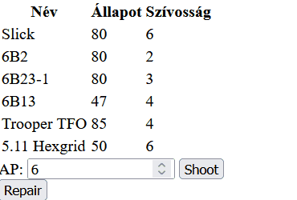

# Csoport ZH

## Páncéltörő

### Lore 

ELTÓ R&D divíziója páncélokat tesztel, minden páncélnak van egy szívóssága, és egy tartóssága, a lőszernek pedig páncéltörési értéke van. Készíts egy programot amiben tudják vezetni hogyan roncsolódnak a különböző páncélok. Egy páncél tartóssága mindig annyival romlik amennyivel nagyobb a lőszer páncéltörése mint a páncél szívóssága. 

A páncélok javíthatók, ha a javítás gombra kattintanak a kijelölt páncélok az eredeti tartósságukra javulnak.

### Feladat

Készíts egy oldalt, az oldalon a táblázatban megjelennek a páncélok adatai, a táblázat sorai legyenek kijelölhetőek. Emellett szerepeljen az oldalon:
 - Egy bementei mező ami csak számot fogad
 - Egy teszt gomb amivel a kijelölt páncélokra lősz
 - Egy javítás gomb ami megjavítja a kijelölt páncélokat

*A feladatokat tetszőleges módszerrel meg lehet oldani, tehát a HTML kiegészíthető azonosítókkal és osztályokkal, használható a dataset, a kiindulási tömb bővíthető és módosítható futás közben, stb.*

#### Az alábbi nyilatkozatot kitöltve illeszd be a scripted elejére, enélkül a megoldás nem lesz elfogadható

```
/*
<Hallgató neve>
<Neptun kódja>
Webprogramozás - JavaScript csoport ZH
Ezt a megoldást a fent írt hallgató küldte be és készítette 
a Webprogramozás kurzus JavaScript csoport ZH-jához.
Kijelentem, hogy ez a megoldás a saját munkám. Nem másoltam vagy 
használtam harmadik féltől származó megoldásokat. Nem továbbítottam 
megoldást hallgatótársaimnak, és nem is tettem közzé. Az Eötvös Loránd 
Tudományegyetem Hallgatói Követelményrendszere (ELTE szervezeti és 
működési szabályzata, II. Kötet, 74/C. §) kimondja, hogy mindaddig, 
amíg egy hallgató egy másik hallgató munkáját - vagy legalábbis annak 
jelentős részét - saját munkájaként mutatja be, az fegyelmi vétségnek számít. 
A fegyelmi vétség legsúlyosabb következménye a hallgató elbocsátása az egyetemről.
*/
```

### Kiinduló kódok

```html
<!DOCTYPE html>
<html lang="en">
<head>
    <meta charset="UTF-8">
    <meta http-equiv="X-UA-Compatible" content="IE=edge">
    <meta name="viewport" content="width=device-width, initial-scale=1.0">
    <title>Csoport ZH</title>
</head>
<style>
    .selected{
        background-color: green;
    }
</style>
<body>
    <table>
    </table>
    AP: <input id="ammo" type="number" value="0"> <button id="pew">Shoot</button> <br>
    <button id="repair">Repair</button>
</body>
<script src="script.js"></script>
</html>
```

```js
[
    {
        name: 'Slick',
        durability: 80,
        class: 6
    },
    {
        name: '6B2',
        durability: 80,
        class:2 
    },
    {
        name: '6B23-1',
        durability: 80,
        class:3
    },
    {
        name: '6B13',
        durability: 47,
        class:4
    },
    {
        name: 'Trooper TFO',
        durability: 85,
        class:4
    },
    {
        name: '5.11 Hexgrid',
        durability: 50,
        class:6
    }
]
```

### Példa



### Pontozás

- A táblázatot sorait js generálja (2)
  - A fejléc generálódik (1)
  - A tartalom generálódik (1) 
- A táblázat sorai kijelölhetőek (2,5)
    - A kijelölés működik (1)
    - A kijelölés levehető (1)
    - A fejléc nem kijelölhető (0,5)
    - Ha a gyakorlaton látott delegál függvényt használod plusz pontokat lehet szerezni, ezzel azonban 10 pont fölé nem mehetsz (+2)
    - *A delegálás függvényt megtalálod **[Az alábbi linken](https://github.com/gvikthor/Webprogramozas/tree/master/20-21-1/3.%20Gyak/Delegalas)***
- A Teszt gomb működik (3)
    - A Kijelölt elemek állapotából levonódik érték (1)
    - A kijelölt elemekből elemenként a megfelelő érték vonódik ki (szívósság - ap) (1)
    - Nulla alá nem esik az állapot (1)
- A javítás gomb kijavítja a kijelölt páncélokat (2,5)
    - Minden páncél ugyan arra az értékre javítódik (1)
    - Minden pácél elemenként az eredeti értékére javítódik (1)
    - Csak a kijelölt páncélok javítódnak (0,5)

### Visszajelzés

Visszajelzést az [alábbi](https://forms.gle/1LsDycyj9g4Vc3bH6) formon tudtok küldeni.