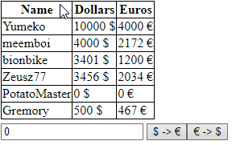

# Csoport ZH

## Changeing Room

### Lore 

ELTÓ büszke országában a turisták sajnos csak nagyon nehezen tudták úgy megoldani a pénzváltást, hogy a kezelési költséget a nemzet kapja.  A kormány úgy döntött, hogy a pénzváltókat ezért államosítani kell, ehhez azonban szükség van egy weboldalra ami számon tartja a pénzmozgást.

Az oldalon láthatóak a felhasználók, egy input mező és két gomb. A felhasználók kijelölhetőek, és a gombok megnyomására az input mezőben található értéket levonjuk a kiinduló pénznemből, majd a konvertált értéket hozzáadjuk a másodlagos pénznemhez, az 5%-os kezelési költség levonásával.

### Feladat

Készíts egy oldalt, az oldalon a táblázatban megjelennek a turisták adatai, a táblázat sorai legyenek kijelölhetőek. Emellett szerepeljen az oldalon:
 - Egy bemeneti mező ami csak számot fogad
 - Egy gomb amivel Dollárt Euróba váltasz (a váltószám 0.86)
 - Egy gomb amivel Eurót Dollárba váltasz (a váltószám 1.16)

*A feladatokat tetszőleges módszerrel meg lehet oldani, tehát a HTML kiegészíthető azonosítókkal és osztályokkal, használható a dataset, a kiindulási tömb bővíthető és módosítható futás közben, stb.*

#### Az alábbi nyilatkozatot kitöltve illeszd be a scripted elejére, enélkül a megoldás nem lesz elfogadható

```
/*
<Hallgató neve>
<Neptun kódja>
Webprogramozás - JavaScript csoport ZH
Ezt a megoldást a fent írt hallgató küldte be és készítette 
a Webprogramozás kurzus JavaScript csoport ZH-jához.
Kijelentem, hogy ez a megoldás a saját munkám. Nem másoltam vagy 
használtam harmadik féltől származó megoldásokat. Nem továbbítottam 
megoldást hallgatótársaimnak, és nem is tettem közzé. Az Eötvös Loránd 
Tudományegyetem Hallgatói Követelményrendszere (ELTE szervezeti és 
működési szabályzata, II. Kötet, 74/C. §) kimondja, hogy mindaddig, 
amíg egy hallgató egy másik hallgató munkáját - vagy legalábbis annak 
jelentős részét - saját munkájaként mutatja be, az fegyelmi vétségnek számít. 
A fegyelmi vétség legsúlyosabb következménye a hallgató elbocsátása az egyetemről.
*/
```

### Kiinduló kódok

```html
<!DOCTYPE html>
<html lang="en">
<head>
    <meta charset="UTF-8">
    <meta http-equiv="X-UA-Compatible" content="IE=edge">
    <meta name="viewport" content="width=device-width, initial-scale=1.0">
    <title>CsoportZH</title>
</head>
<style>
    table{
        border-collapse: collapse;
        border: 1px solid black;
        margin-bottom: 5px;
    }
    td, tr, th{
        border-collapse: collapse;
        border: 1px solid black;
    }
    .selected{
        color: red
    }
</style>
<body>
    <table>
    </table>
    <input type="number" id="in" value="0"> <button id="dte">$ -> €</button><button id="etd">€ -> $</button>
</body>
<script src="script.js"></script>
</html>
```

```js
[
    {
        username: "Yumeko",
        dollars: 10000,
        euros: 4000
    },
    {
        username: "meemboi",
        dollars: 4000,
        euros: 2172
    },
    {
        username: "boionbike",
        dollars: 3401,
        euros: 1200
    },
    {
        username: "Zeusz77",
        dollars: 3456,
        euros: 2034
    },
    {
        username: "PotatoMaster",
        dollars: 0,
        euros: 0
    },
    {
        username: "Gremory",
        dollars: 500,
        euros: 467
    }
]
```

### Példa



### Pontozás

- A táblázatot sorait js generálja (2,5)
  - A fejléc generálódik (1)
  - A tartalom generálódik (1)
  - A mintához hasonló módon megjelenik az érték mögött a pénznem (0,5)
- A táblázat sorai kijelölhetőek (2,5)
    - A kijelölés működik (1)
    - A kijelölés levehető (1)
    - A fejléc nem kijelölhető (0,5)
    - Ha a gyakorlaton látott delegál függvényt használod plusz pontokat lehet szerezni, ezzel azonban 10 pont fölé nem mehetsz (+1,5)
    - *A delegálás függvényt megtalálod **[Az alábbi linken](https://github.com/gvikthor/Webprogramozas/tree/master/20-21-1/3.%20Gyak/Delegalas)***
- Az átváltó gombok működnek (5,5)
    - Az első elem értéke megfelelően változik. (1)
    - Az összes elem értéke megfelelően változik (1)
    - Csak a kijelölt elemek értéke változik, megfelelően (2)
    - Az átváltás az egyik irányba működik (1)
    - Az átváltáskor levonódik az 5%-os kezelésí költség (0,5)

### Visszajelzés

Visszajelzést az [alábbi](https://forms.gle/BTUJ7TZmfRSe78GT7) formon tudtok küldeni.